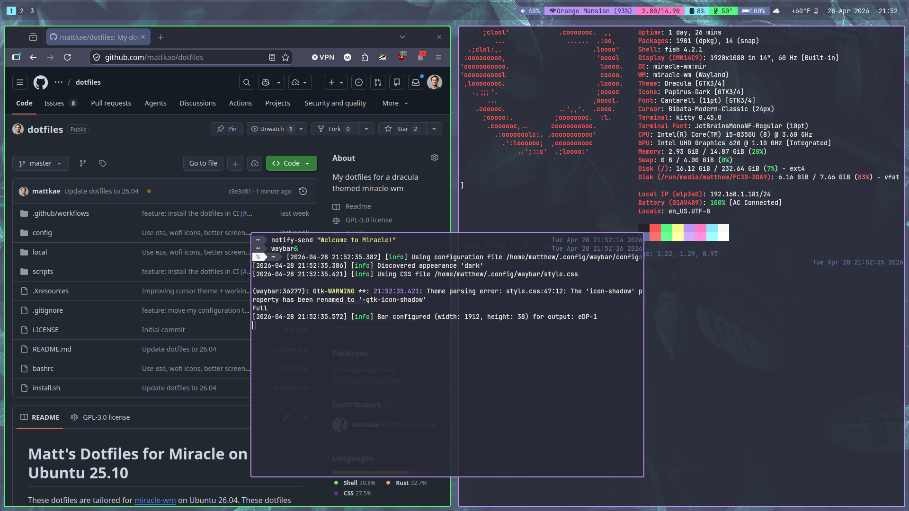

# Matt's Dotfiles for Miracle on Ubuntu 26.04
These dotfiles are tailored for [miracle-wm](https://github.com/miracle-wm-org/miracle-wm)
on Ubuntu 26.04. These dotfiles are very much geared towards
my (corporate-ish) development life that largely revolves around C++, web, python,
and other types of development.

Some dependencies that are not packaged in the Ubuntu archive are built from
source here.

I very much enjoy Dracula theming, so that's what you'll be getting if you
install this 🧛

Note that this configuration will only work with the latest version of miracle-wm in the
repository, so this is more of a rolling release than anything.

## Screenshot


## Software

### Desktop
- [miracle-wm](https://github.com/miracle-wm-org/miracle-wm) — Wayland compositor / window manager
- [swaylock](https://github.com/swaywm/swaylock) — lockscreen
- [swaync](https://github.com/ErikReider/SwayNotificationCenter) — notifications
- [wofi](https://github.com/SimplyCEO/wofi) — launcher
- [waybar](https://github.com/Alexays/Waybar) — top panel
- [swww](https://github.com/LGFae/swww) — animated wallpaper daemon (rotates the background)
- [kitty](https://sw.kovidgoyal.net/kitty/) — terminal
- [wlogout](https://github.com/ArtsyMacaw/wlogout) — logout screen
- [fish](https://fishshell.com/) — shell
- [Oh My Fish](https://github.com/oh-my-fish/oh-my-fish) — fish shell framework
- [bobthefish](https://github.com/oh-my-fish/theme-bobthefish) — fish prompt theme
- [grimshot](https://man.archlinux.org/man/grimshot.1.en) — screenshots
- [slurp](https://github.com/emersion/slurp) — region selection for screenshots
- [nm-connection-manager](https://wiki.gnome.org/Projects/NetworkManager) — network control
- [bat](https://github.com/sharkdp/bat) — better `cat`
- [fdfind](https://github.com/sharkdp/fd) — better `find`
- [eza](https://github.com/eza-community/eza) — better `ls`
- [pamixer](https://github.com/cdemoulins/pamixer) — volume adjustment
- [brightnessctl](https://github.com/Hummer12007/brightnessctl) — brightness management
- [wl-clipboard](https://github.com/bugaevc/wl-clipboard) — clipboard for Wayland
- [pavucontrol](https://gitlab.freedesktop.org/pulseaudio/pavucontrol) — sound control
- [nautilus](https://gitlab.gnome.org/GNOME/nautilus) — file manager
- [playerctl](https://github.com/altdesktop/playerctl) — media player control
- [fastfetch](https://github.com/fastfetch-cli/fastfetch) — system info display
- [Bibata Modern Classic](https://github.com/ful1e5/Bibata_Cursor) — cursor theme

### Development
- [Rust](https://www.rust-lang.org/) — via rustup
- [Go](https://go.dev/) — via apt
- [pyenv](https://github.com/pyenv/pyenv) — Python version manager
- [clang / clangd](https://clang.llvm.org/) — C/C++ compiler and language server
- [cmake](https://cmake.org/) — build system
- [ripgrep](https://github.com/BurntSushi/ripgrep) — fast grep
- [bun](https://bun.sh/) — JavaScript runtime and package manager
- [Flutter](https://flutter.dev/) — cross-platform UI SDK

## Fonts
- [Iosevka](https://github.com/be5invis/Iosevka)
- [JetBrains Mono Nerd](https://github.com/ryanoasis/nerd-fonts)

## Icons
- [Papirus Icon Theme](https://github.com/PapirusDevelopmentTeam/papirus-icon-theme)

## Requirements

**Ubuntu 26.04 is required.** The install script will exit immediately if run on any other OS or version.

## Install

> [!CAUTION]
> **Only install on a fresh machine.** This script is destructive — it will overwrite your existing dotfiles, shell configuration, and system packages without the ability to recover them. Do **not** run this on a machine with configuration you care about.

First, clone the repo:
```sh
git clone git@github.com:mattkae/dotfiles.git
```

Next, run the `install` script:

```sh
./install.sh [OPTIONS]
```

The script always installs dependencies, miracle-wm, fonts, and screenshare support. Optional flags:

```
Options:
  --yes                   Skip confirmation prompt
  --help                  Show this help message and exit
```

## Directories
- `~/.local/bin`: local scripts
- `~/.local/src`: local source projects
- `~/.local/share/wallpapers`: the lockscreen image, plus a `rotation/` set that the background cycles through

## Configurations
The primary configuration is `~/.config/miracle-wm/config.yaml`. Users may place
any machine-specific configuration in `~/config/miracle-wm/user-config.yaml`.
For example, I run `xdg-desktop-portal-wlr` there so that screensharing works.

## Fish
- Users may add custom fish configuration in `~/.config/fish/user.sh`.

## Credits
- Rotating 4K wallpapers come from [aynp/dracula-wallpapers](https://github.com/aynp/dracula-wallpapers) (the `Art/4k` collection).
